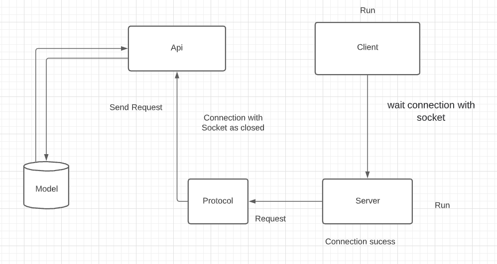

Para o funcionamento da aplicação : 

Step 1 - Run springSocket , é por ele que vai dar o start na Api

Step 2 - Run Server , o server será responsável por aguardar a informações do client.

Step 3 - Run ClientSocket o client socket será responsavel por enviar a mensagem ao server, e logo após enviado ocorrerá o stop do client com a mensagem já enviada ao server que ira para Api , por final os dados estarão armazenados no repository mongodb

